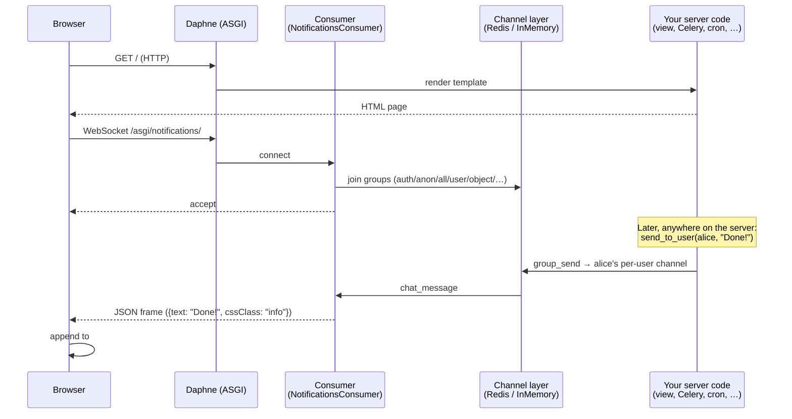

# django-channels-broadcast

[](https://github.com/iplweb/django-channels-broadcast/actions/workflows/tests.yml)
[](LICENSE)

> Pluggable websocket notifications for Django. Real-time messages,
> redirects and progress bars — to a single user, a single page, or
> a broadcast audience. Secure by default.

---

## What this does, in 30 seconds

You want to send a message **from your Python code to an open browser
tab without the user refreshing the page**. That's it. Three lines:

```python
# In a view, signal handler, Celery task, management command, …
from channels_broadcast import send_to_user
send_to_user(alice, "Your import finished!", level="success")
```

Five seconds later, every tab Alice has open shows a green "Your import
finished!" pop-up. Bob, who shares the building's Wi-Fi but is logged in
as a different user, sees nothing. Anonymous visitors see nothing.

That's the **core promise**. There are five "audience" variants
(`send_to_all` / `_authenticated` / `_anonymous` / `_user` / `_object` /
`_channel`) and three payload kinds (text **message**, **redirect** the
page to a URL, **progress** bar update) — but the mental model is just
"send X to Y".

---

## Table of contents

- [Try the demo locally (90 seconds)](#try-the-demo-locally-90-seconds)
- [Concepts you'll meet](#concepts-youll-meet)
- [How it works (architecture)](#how-it-works-architecture)
- [Why does this library exist?](#why-does-this-library-exist)
- [Installation — step by step](#installation--step-by-step)
- [Sending notifications](#sending-notifications)
- [Frontend integration](#frontend-integration)
- [Settings](#settings)
- [Security model](#security-model)
- [Object-channel subscriptions (per-page)](#object-channel-subscriptions-per-page)
- [Management command (`send_notification`)](#management-command)
- [Troubleshooting / FAQ](#troubleshooting--faq)
- [Feature list](#feature-list)
- [Supported versions](#supported-versions)
- [Development](#development)
- [License](#license)

---

## Try the demo locally (90 seconds)

The repo ships an `example/` Django project that demonstrates **every
audience mode** plus the per-page and signed-token flows. Easiest way to
see the library in action:

```bash
git clone https://github.com/iplweb/django-channels-broadcast
cd django-channels-broadcast
uv sync --all-extras

cd example
uv run python manage.py migrate
uv run python manage.py createsuperuser     # username/password — anything works
uv run python manage.py runserver
```

Open <http://127.0.0.1:8000/> in **two windows side-by-side**:

1. one normal — log in at `/admin/` first
2. one in **incognito mode** — anonymous

Pick an audience from the form, hit *Send*. Watch which tab gets the
message. That's the whole library.

---

## Concepts you'll meet

If you've never worked with websockets in Django, here's the vocabulary
in plain English. Skip if you know it.

| Term | What it means here |
|---|---|
| **WebSocket** | A long-lived connection between browser and server. Either side can send messages whenever — unlike HTTP, which is request-then-response. |
| **ASGI** | The async cousin of WSGI. Required to serve websockets. The `runserver` you know is WSGI-only; `daphne` (or `uvicorn`) is ASGI. |
| **Channels** | The Django package that makes websockets work. It defines a `ChannelLayer` — a message bus where every websocket connection gets an address. We sit on top of it. |
| **Channel layer** | The Redis-or-in-memory bus that delivers messages between server-side code and connected websockets. Production: `channels-redis`. Dev/tests: `InMemoryChannelLayer`. |
| **Consumer** | Channels' name for the class that handles one websocket. We ship `NotificationsConsumer` — you usually don't touch it. |
| **Audience** | Our concept. Who receives a notification: `all`, `authenticated`, `anonymous`, one `user`, one `object`-page, or a raw `channel` UID. |
| **Per-page channel** | A channel name derived from a Django model row's `ContentType` + `pk` — e.g. `articles.article-42`. When the user opens `/articles/42/`, the page subscribes; messages sent there land only on that page. |
| **Signed token** | A short-lived, cryptographically signed string that says "this user may subscribe to these channels". Use it for one-off UIDs (background-task progress streams) where the channel name isn't a Django model row. |
| **Authorizer** | A callback you write that decides whether a given user is allowed to subscribe to a given channel. Default deny. |

---

## How it works (architecture)



The interesting part: **your server-side code never talks to the
browser directly**. You push a message into the channel layer with one
function call; the library handles which group it lands in, the consumer
delivers it to subscribed websockets, and the bundled JS renders it.

---

## Why does this library exist?

Most Django notification libraries assume "every message goes to a user
row in the database." That's fine for inbox-style notifications, but
falls over the moment you want to broadcast to anonymous visitors, to
everyone watching a single page, or to a transient cohort that doesn't
map cleanly to `auth.User`.

`django-channels-broadcast` is the thin layer this project kept rewriting
in-house: a handful of `send_to_X` functions on top of `channels.layers`,
each backed by a documented channel-group name, each individually
toggleable in `settings.py`. Anonymous defaults to off because opening a
websocket for every public visitor is the kind of decision you want to
make deliberately, not by accident.

---

## Installation — step by step

This is the section to read carefully if you're new to channels. There
are five small steps.

### 1. Install the package

```bash
uv add django-channels-broadcast
# or:
pip install django-channels-broadcast
```

### 2. Add it to `INSTALLED_APPS` (with `daphne` FIRST)

```python
# settings.py
INSTALLED_APPS = [
    "daphne",                       # MUST be first
    "django.contrib.admin",
    "django.contrib.auth",
    # … your other django.contrib.* apps
    "channels",
    "channels_broadcast",
    # … your own apps
]
```

> **Why must `daphne` come first?** Stock `./manage.py runserver` serves
> HTTP only. With `daphne` listed first, Channels swaps in an ASGI-aware
> version that handles both HTTP and WebSocket on the same port.
> Without it: every `/asgi/notifications/` connect 404s and you'll
> wonder why nothing happens. See the FAQ below.

### 3. Wire the websocket route into `asgi.py`

```python
# asgi.py
import os
from channels.auth import AuthMiddlewareStack
from channels.routing import ProtocolTypeRouter, URLRouter
from django.core.asgi import get_asgi_application

os.environ.setdefault("DJANGO_SETTINGS_MODULE", "myproject.settings")
django_asgi_app = get_asgi_application()

from channels_broadcast.routing import websocket_urlpatterns  # noqa: E402

application = ProtocolTypeRouter({
    "http": django_asgi_app,
    "websocket": AuthMiddlewareStack(URLRouter(websocket_urlpatterns)),
})
```

### 4. Configure a channel layer

For local development:

```python
# settings.py
CHANNEL_LAYERS = {
    "default": {"BACKEND": "channels.layers.InMemoryChannelLayer"},
}
```

For production (multi-process), install `channels-redis` and:

```python
CHANNEL_LAYERS = {
    "default": {
        "BACKEND": "channels_redis.core.RedisChannelLayer",
        "CONFIG": {"hosts": [("127.0.0.1", 6379)]},
    },
}
```

### 5. Run migrations

```bash
./manage.py migrate channels_broadcast
```

(One table: `Notification`, for replay-on-reconnect.)

### 6. Add the JS client to your base template

```html

<div id="messagesPlaceholder"></div>
<script id="messageTemplate" type="text/x-template">
  <div class="callout {{ cssClass }}">{{ text }}</div>
</script>

<script src="https://code.jquery.com/jquery-3.7.1.min.js"></script>
<script src=""></script>
<script src=""></script>
<script>channelsBroadcast.init();</script>
```

That's it. Now `send_to_user(...)` from any Python code reaches that
user's open tabs.

For a non-jQuery / right-side-toast / audio-chime setup see
[Frontend integration](#frontend-integration) below.

---

## Sending notifications

Three payload families, six target variants each.

### Messages

```python
from channels_broadcast import (
    send_to_all, send_to_authenticated, send_to_anonymous,
    send_to_user, send_to_object, send_to_channel,
)

send_to_all("System maintenance starts in 10 minutes.", level="warning")
send_to_authenticated("New report available.")
send_to_anonymous("Welcome — sign in to save your work.")
send_to_user(user, "Your import finished.")
send_to_object(article, "Someone just commented on this page.")
send_to_channel("op-uid-42", "Step 3 of 5 complete.")   # raw channel name
```

`level` accepts a `django.contrib.messages` constant (`INFO`, `SUCCESS`,
`WARNING`, `ERROR`) or a string CSS class (`"info"`, `"success"`,
`"warning"`, `"error"`).

### Redirects

Tell the receiving page to navigate. Useful at the end of a long-running
task — bounce the user from a progress page to the results page without
polling.

```python
from channels_broadcast import redirect_user, redirect_object, redirect_channel

redirect_user(user, "/reports/42/")
redirect_object(report, "/reports/42/results/")
redirect_channel("op-uid-42", "/done/")
```

### Progress

Push a percent to whatever page is showing a progress bar. The bundled
JS client looks for a `#notifications-progress` element by default; or
write your own listener for `{"progress": true, "percent": "42%"}`.

```python
from channels_broadcast import progress_user, progress_object, progress_channel

progress_user(user, 42)          # → "42%"
progress_object(report, 75)
progress_channel("op-uid-42", 100)
```

`percent` accepts int, float, or string. A `%` is appended if missing.

---

## Frontend integration

Three JS files ship under `static/channels_broadcast/js/`:

| File | What it does |
|---|---|
| `notifications.js` | **Required.** Opens the websocket; dispatches incoming `{text}` / `{url}` / `{progress, percent}` payloads. Default text rendering uses jQuery + Mustache to append to `#messagesPlaceholder`. Falls back to vanilla-JS DOM if neither is available. Exposes `window.channelsBroadcast`. |
| `notifications-toastify.js` | Optional. Calls `channelsBroadcast.useToastify({...})` to swap the default appender for right-side toast popups via [Toastify](https://github.com/apvarun/toastify-js) (~3KB, MIT). Redirects and progress payloads keep working unchanged. |
| `notifications-chime.js` | Optional. Plays a four-note arpeggio on each incoming message via [Tone.js](https://tonejs.github.io/). Calls `channelsBroadcast.enableChime()` after `init()` to install the hook. Defers audio context until first user gesture (browser autoplay policies). |

### Default — inline Foundation/Bootstrap-style alerts

```html

<div id="messagesPlaceholder"></div>
<script id="messageTemplate" type="text/x-template">{# Mustache template #}
  <div class="callout {{ cssClass }}">{{ text }}</div>
</script>

<script src="https://code.jquery.com/jquery-3.7.1.min.js"></script>
<script src=""></script>
<script src=""></script>
<script>
  channelsBroadcast.init({{ extraChannels|default:"null"|json_script:"" }});
</script>
```

### Pretty mode — right-side toasts (Toastify)

```html
<link rel="stylesheet" href="https://cdn.jsdelivr.net/npm/toastify-js/src/toastify.css">
<script src="https://cdn.jsdelivr.net/npm/toastify-js"></script>
<script src=""></script>
<script src=""></script>
<script>
  channelsBroadcast.useToastify({duration: 4000, gravity: "top", position: "right"});
  channelsBroadcast.init();
</script>
```

After `useToastify()`, any `send_to_*("text...")` call appears as a sliding toast in the top-right (default — `position` and `gravity` are configurable). The `cssClass` field maps to a per-level gradient; override with `classMap`.

### Audio chime (Tone.js)

```html
<script src="https://unpkg.com/tone@15/build/Tone.js"></script>
<script src=""></script>
<script src=""></script>
<script>
  channelsBroadcast.init();
  channelsBroadcast.enableChime();
</script>
```

### Wire format (for writing your own client)

The server sends one JSON object per websocket frame:

```js
// message:
{"text": "...", "cssClass": "info"|"success"|"warning"|"error",
 "clickURL": "...", "closeURL": "...", "hideCloseOption": false}

// redirect:
{"url": "/results/"}

// progress:
{"progress": true, "percent": "42%"}
```

If `id` is present, the server expects the client to ACK with
`{"type": "ack_message", "id": <id>}` so it doesn't replay this
`Notification` row on the next reconnect. The bundled JS does this for
you.

---

## Settings

### Audience gates

Every audience is **independently toggleable**. Set any of these to
`False` in `settings.py` to turn off that audience entirely — the
consumer refuses to join the corresponding group and the matching
`send_to_*` function becomes a no-op.

| Setting | Default | What turning it off does |
|---|---|---|
| `CHANNELS_BROADCAST_ENABLE_ALL` | `True` | `send_to_all()` becomes a no-op and the consumer doesn't join the broadcast group. |
| `CHANNELS_BROADCAST_ENABLE_AUTHENTICATED` | `True` | `send_to_authenticated()`, `send_to_user()`, `redirect_user()`, `progress_user()` are no-ops; consumer skips the authenticated-only group and the per-user channel. |
| `CHANNELS_BROADCAST_ENABLE_ANONYMOUS` | `False` | **The consumer closes anonymous connections before `.accept()` — no websocket is opened for them.** `send_to_anonymous()` is a no-op. |
| `CHANNELS_BROADCAST_ENABLE_PAGE_CHANNELS` | `True` | `send_to_object()` / `redirect_object()` / `progress_object()` / `*_channel()` are no-ops; consumer ignores `?extraChannels=` and `?subscription_token=` subscriptions. |

The most security-relevant flag is `ENABLE_ANONYMOUS`. Off by default so anonymous visitors don't open a connection at all — flip it on deliberately.

### Subscription authorization

| Setting | Default | Effect |
|---|---|---|
| `CHANNELS_BROADCAST_SUBSCRIPTION_AUTHORIZER` | `None` (deny all) | Dotted path to a callable `(user, channel_name) -> bool` that decides whether a `?extraChannels=` entry is allowed. See "Security model" below. |

---

## Security model

The websocket has the same authentication the rest of your Django app
does (session cookie, via `AuthMiddlewareStack`). Beyond that, the
consumer composes its channel subscriptions from four sources, in order
of increasing client influence:

1. **Audience groups** derived from `scope["user"]` and the
   `ENABLE_*` flags. Always trusted — server-controlled.
2. **Per-user channel** for authenticated users. Always trusted.
3. **`?extraChannels=` query param** — every channel name passes through
   a configurable authorizer. **Default: deny.**
4. **`?subscription_token=` query param** — a server-signed binding of
   `(user, channels, expiry)`. Bypasses the authorizer; the signature
   already proves authorization.

### Threat model

- A page rendered by your views may ask for `?extraChannels=…` — but
  the consumer doesn't trust the request: the authorizer decides.
- A user who edits the page source to add arbitrary channels gets no
  subscriptions for them (default authorizer denies all).
- A user who steals another user's signed token can't replay it — the
  bound user is checked against `scope["user"]` at connect time.
- Anonymous users get no websocket at all if `ENABLE_ANONYMOUS=False`
  (default).

### Configuring the authorizer

For `?extraChannels=` to ever subscribe, point Django at a callable:

```python
# settings.py
CHANNELS_BROADCAST_SUBSCRIPTION_AUTHORIZER = "myapp.notif.authorize"
```

```python
# myapp/notif.py
from channels_broadcast import get_obj_from_channel_name

def authorize(user, channel_name):
    """Return True if user is allowed to subscribe to channel_name."""
    try:
        obj = get_obj_from_channel_name(channel_name)
    except Exception:
        return False
    return user.has_perm("can_view", obj)
```

The function runs once per channel at connect time. Channels it denies
are silently dropped (no information about which channels exist leaks
back to the client).

### Server-issued UID channels (signed tokens)

When the channel isn't backed by a Django model — for example, a
per-page UUID for a long-running background task — issue a token:

```python
import uuid
from channels_broadcast import issue_subscription_token

def my_view(request):
    stream_uid = str(uuid.uuid4())
    token = issue_subscription_token(
        user=request.user,            # bound to this user (or None for anon)
        channels=[stream_uid],
        ttl=300,                      # 5 minutes
    )
    return render(request, "stream.html", {
        "stream_uid": stream_uid,
        "subscription_token": token,
    })
```

```html
{{ subscription_token|json_script:"sub-token" }}
<script>
  var token = JSON.parse(document.getElementById("sub-token").textContent);
  var ws = new WebSocket(
    "ws://example.com/asgi/notifications/"
    + "?subscription_token=" + encodeURIComponent(token));
</script>
```

The consumer verifies signature, user binding, and TTL, then subscribes
to `stream_uid`. Tokens are **stateless** — uses Django's
`TimestampSigner`, signed with `SECRET_KEY`, no Redis or DB required.
If you eventually need revocation (e.g. on logout), write a thin
revocation list and check it in a custom consumer — most apps don't
need it.

### Pushing messages to UID channels

From a Celery worker, view, or anywhere on the server side:

```python
from channels_broadcast import progress_channel, send_to_channel

progress_channel(stream_uid, 42)
send_to_channel(stream_uid, "Done!", level="success")
```

---

## Object-channel subscriptions (per-page)

In a class-based view:

```python
from django.views.generic import DetailView
from channels_broadcast.mixins import ChannelSubscriberSingleObjectMixin

class ArticleDetail(ChannelSubscriberSingleObjectMixin, DetailView):
    model = Article
```

Then in the template, render the channel list into a query string that
the frontend JS hands to the websocket as `?extraChannels=…`. The
included static files (`channels_broadcast/js/notifications.js`)
already do this — read the source for the wiring.

---

## Management command

`./manage.py send_notification` reaches every function in
`channels_broadcast.api` — messages, redirects, progress — across
every audience target. Useful for cron jobs, ad-hoc operator pokes,
and shell pipelines from Celery / systemd / k8s jobs.

Three orthogonal flags:

```
--kind={message,redirect,progress}   what to send (default: message)
--audience={all,authenticated,anonymous,user,object,channel}
                                     who gets it
<payload>                            text / URL / percent (positional)
```

Plus target-specific flags:

```
--username=<name>            when --audience=user
--object=app.Model:pk        when --audience=object
--channel=<name>             when --audience=channel
--level={info,success,warning,error}   for --kind=message only
```

### Messages

```bash
# Audience broadcasts
./manage.py send_notification --audience=all          "Maintenance in 5 min" --level=warning
./manage.py send_notification --audience=authenticated "New monthly report"
./manage.py send_notification --audience=anonymous     "Welcome — please sign in"

# Targeted at one user (all of their open tabs)
./manage.py send_notification --audience=user --username=alice "Your import finished"

# Targeted at one Django model row's per-page channel
./manage.py send_notification --audience=object --object=bpp.Publication:42 \
    "Someone commented on this page"

# Targeted at a raw channel name — e.g. a server-issued UID
./manage.py send_notification --audience=channel --channel=stream-abc123 \
    "Hi UID subscriber"
```

### Redirects

`--kind=redirect`. Payload is the URL to navigate the receiving page to.
Useful at the end of a long-running task — bounce a user from the
progress page to the results page without polling.

```bash
./manage.py send_notification --kind=redirect --audience=user \
    --username=alice /reports/42/results/

./manage.py send_notification --kind=redirect --audience=object \
    --object=bpp.Report:42 /reports/42/results/

./manage.py send_notification --kind=redirect --audience=channel \
    --channel=stream-abc123 /done/
```

Broadcast redirects (`--audience=all/authenticated/anonymous`) are
rejected — redirecting everyone is almost never what you want, and if
it is you can script it with multiple `--audience=user` calls.

### Progress

`--kind=progress`. Payload is the percent — int, float, or a string with
or without a `%` sign. The bundled JS client updates a
`#notifications-progress` element's width on receipt.

```bash
./manage.py send_notification --kind=progress --audience=user \
    --username=alice 42

./manage.py send_notification --kind=progress --audience=object \
    --object=bpp.Operation:7 75

./manage.py send_notification --kind=progress --audience=channel \
    --channel=stream-abc123 100%
```

### Exit behaviour

- Success: exit 0, no output.
- An audience the relevant `CHANNELS_BROADCAST_ENABLE_*` flag has
  disabled: exit 0 with a `No-op: ...` warning on stdout (so cron jobs
  don't fail, but you can grep for the warning if you care).
- Bad inputs (missing `--username` for `--audience=user`, unknown
  model, invalid object spec, `--kind=redirect --audience=all`, etc.):
  exit non-zero with a `CommandError` message on stderr.

### Interactive mode

Run the command with no arguments (or with only some flags) from a
terminal — it'll prompt for whatever's missing:

```
$ ./manage.py send_notification
Kind:
  1) message (default)
  2) redirect
  3) progress
Choose [1-3, enter=message]: <Enter>
Audience:
  1) all
  2) authenticated
  3) anonymous
  4) user
  5) object
  6) channel
Choose [1-6]: 4
Username: alice
Level:
  1) info (default)
  2) success
  3) warning
  4) error
Choose [1-4, enter=info]: 3
Message text: Server reboot in 5 minutes
```

Each prompt accepts either the number or the name itself
(`message`/`success`/`alice` etc.). Enter alone picks the default
where one's marked. `q` or Ctrl-D cancels.

When stdin **isn't** a TTY (cron, systemd, CI, piped input), the
command does not hang — it fails fast with a clear "X is required"
error so you can fix the script:

```
$ echo "" | ./manage.py send_notification
CommandError: --audience is required (pass it as a flag, or run
interactively from a TTY to get a prompt).
```

---

## Troubleshooting / FAQ

### "`Not Found: /asgi/notifications/` — my websocket 404s"

You're running stock `./manage.py runserver`, which is HTTP-only.
Channels needs an ASGI server. Easiest fix: put `"daphne"` **first** in
`INSTALLED_APPS`. Then `runserver` is replaced with the Daphne version
that handles both HTTP and WebSocket. See [step 2 of installation](#2-add-it-to-installed_apps-with-daphne-first).

### "I called `send_to_user(...)` and nothing happens"

Walk this checklist in order:

1. Is the user's tab actually open with the JS client loaded? (Open
   devtools → Network → filter on WS. You should see one connection in
   the "101 Switching Protocols" state.)
2. Is `CHANNELS_BROADCAST_ENABLE_AUTHENTICATED = True` in settings?
   (Default yes, but if you disabled it, `send_to_user` becomes a
   no-op.)
3. Is your channel layer working? Try `send_to_all("hi")` from a shell
   — if even that doesn't appear, channels itself isn't routed. Check
   `asgi.py` wiring.
4. Are you running tests / management commands sequentially without
   restarting? Some `InMemoryChannelLayer` weirdness — restart the
   process.

### "`send_to_object(article, ...)` reaches everyone, not just the article's page"

The article page needs to actually subscribe to the object's channel.
Either:

- Use `ChannelSubscriberSingleObjectMixin` on the DetailView (auto-
  subscribes via `get_object()`); **and** configure
  `CHANNELS_BROADCAST_SUBSCRIPTION_AUTHORIZER` (default is deny-
  all, so the consumer rejects the subscription request silently); **and**
  pass the `extraChannels` from context into `channelsBroadcast.init()`.
- Or pass `?extraChannels=...` manually from your own template.

See [example/demo_app](./example/demo_app/) for a working setup.

### "Anonymous users can't subscribe to anything"

By design. `CHANNELS_BROADCAST_ENABLE_ANONYMOUS = False` is the
default — the consumer closes anonymous connections before `.accept()`
so no websocket opens at all. Flip the setting to `True` if you want
broadcast-to-anon.

### "I want to send a redirect to everyone"

You can't via `--kind=redirect --audience=all` — that's deliberately
rejected (a server forcing a navigate on every connected client is
almost always a bug, and if it isn't, you should be sure enough to
script the loop yourself). The library doesn't ship that footgun.

### "WebSocket disconnects after some time, no reconnect"

The bundled JS reconnects with exponential backoff by default. If
you're seeing permanent disconnects in production, check:

- Are you behind a proxy with idle-timeout? (Nginx `proxy_read_timeout`,
  Cloudflare's 100-second idle close, etc.) Increase or send ping
  frames.
- Is your `channels-redis` connection healthy? Redis dropping causes
  silent stalls.
- Did the user close+reopen the tab? `pagehide` closes our socket
  intentionally on tab switch — the next page-load reconnects.

### "Where does the message get rendered?"

The shipped JS client appends to a `<div id="messagesPlaceholder">` via
a Mustache template at `<script id="messageTemplate">`. If you don't
have either element in the page, **nothing visible happens** — the
websocket frame arrived, but had nowhere to land. Check your base
template. Or load `notifications-toastify.js` for popup toasts that
don't need a placeholder div.

### "How do I write tests for notifications I trigger?"

Two layers. Server-side: patch `channels_broadcast.api._send`
with a recorder, then assert the right channel + payload. (See
[tests/test_api.py](./tests/test_api.py) for examples.) End-to-end with
real websocket: use `channels.testing.WebsocketCommunicator` — see
[tests/test_consumer_audience.py](./tests/test_consumer_audience.py).

### "Channel layer says `InMemoryChannelLayer` is single-process — what does that mean?"

It means messages sent by process A never reach websocket connections
on process B. Fine for `./manage.py runserver` (one process), fine for
tests, useless for production where you'll have multiple worker
processes. Use `channels-redis` in production. The library doesn't care
which channel layer you use — it just calls `get_channel_layer()`.

### "Do I need Celery?"

No. The library is just a transport layer — you can call `send_to_*`
from any sync or async Python code: views, signals, management
commands, RQ workers, Celery tasks, a `manage.py shell` REPL. Celery
is only mentioned in the docs because long-running tasks (the ideal
target for progress updates) often live there.

### "I want to add a `subscribeMore(channel)` method to the JS client"

That's a feature the server-side consumer doesn't yet support — channel
subscriptions are decided at websocket open. Workaround: close and
reopen the socket with a new `extraChannels` / `subscription_token`.
PRs welcome.

---

## Feature list

If you want the quick reference rather than the prose:

- **Six audience targets**, three payload kinds — 18 functions total
  (`send_to_*` / `redirect_*` / `progress_*` × `all` / `authenticated` /
  `anonymous` / `user` / `object` / `channel`).
- **Per-audience feature flags** — disabling an audience is a real off
  switch: the consumer refuses to join the group, and for anonymous
  visitors the websocket itself is never opened.
- **Per-page subscriptions** via `ChannelSubscriberSingleObjectMixin` —
  pages auto-subscribe to a `<app_label>.<model>-<pk>` channel through
  `ContentType`, gated by an authorizer hook.
- **Default-deny on `?extraChannels=`** — the consumer will not subscribe
  any channel a hostile page asks for unless a configured authorizer
  callback explicitly returns True. No "trust the browser" defaults.
- **Signed subscription tokens** — bind a server-issued UID/UUID channel
  to a specific user for N minutes using Django's signing framework.
  Stateless, no Redis needed.
- **Replay on reconnect**: unacknowledged `Notification` rows are
  re-sent the next time a relevant client connects.
- **Auto-reconnect JS client** with exponential backoff, re-entrant
  `init()`, binary-frame guard, `onConnectionChange` hook.
- **`send_notification` management command** with full
  CLI + interactive-wizard coverage of all 18 API functions.
- **Drop-in JS plugins** — opt-in Toastify-js right-side toasts,
  opt-in Tone.js chime.

---

## Supported versions

### Python × Django (tested in CI)

| Django  | 3.10 | 3.11 | 3.12 | 3.13 | Status                      |
|---------|------|------|------|------|-----------------------------|
| 5.2 LTS | ✓    | ✓    | ✓    | ✓    | Active LTS (until Apr 2028) |
| 6.0     | —    | —    | ✓    | ✓    | Active                      |

(Python 3.10–3.13 supported. Django 6.0 dropped support for Python ≤ 3.11,
so those cells are intentionally blank.)

### Other dependencies

- `channels` ≥ 4.0
- `asgiref` ≥ 3.7
- `nest-asyncio` ≥ 1.6
- A channel-layer backend at runtime — `channels-redis` in production,
  `channels.layers.InMemoryChannelLayer` in tests / single-process dev.

---

## Development

```bash
git clone https://github.com/iplweb/django-channels-broadcast
cd django-channels-broadcast
uv sync --all-extras
DJANGO_SETTINGS_MODULE=tests.settings uv run pytest    # Python tests (113)
npm install && npm test                                # JS tests (46, QUnit + sinon + jsdom)
```

Pre-commit:

```bash
uv run pre-commit install
```

---

## License

MIT — see [LICENSE](./LICENSE).
